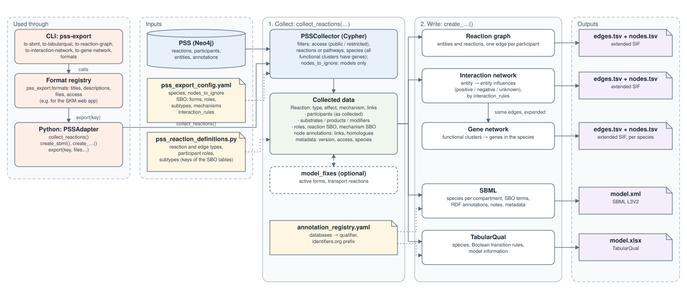

# skm-pss-export

Export models from the Plant Stress Signalling (PSS) Neo4j knowledge graph to various file formats. 




(Figure source: `docs/make_overview_svg.py`.)

## Installation
 
Install directly from GitHub:
```bash
pip install git+https://github.com/NIB-SI/skm-pss-export.git
```
 
Alternatively, clone and install locally:
```bash
git clone https://github.com/NIB-SI/skm-pss-export.git
cd skm-pss-export
pip install .
```
 
For development (editable install):
```bash
git clone https://github.com/NIB-SI/skm-pss-export.git
cd skm-pss-export
pip install -e .
```
 

## PSS database

For testing, a snapshot of the PSS database is available at:
https://github.com/NIB-SI/skm-neo4j

### Connection to Neo4j

You can pass the connection settings (uri, username, password) to the CLI using command-line arguments: 

```bash
  --neo4j-uri TEXT       Neo4j connection URI.
  --neo4j-user TEXT      Neo4j username.
  --neo4j-password TEXT  Neo4j password.
```

Alternatively, set them as environment variables, or in an `.env` file in the current directory, using the following variables:
```bash
MY_NEO4J_URI=bolt://localhost:7687
MY_NEO4J_USER=neo4j
MY_NEO4J_PASSWORD=password
```

Each setting is taken from the argument if given, otherwise from the environment, otherwise from the `.env` file.

If you used the defaults in the [skm-neo4j](https://github.com/NIB-SI/skm-neo4j) repo, you can use the `.env.example` file as provided. 
```bash
mv .env.example .env
```

## Python usage

The package handles the database connection itself: it connects only while collecting data, and closes the connection afterwards.

```python
from pss_export import PSSAdapter

# connection settings as arguments, or from the environment / .env
adapter = PSSAdapter(neo4j_uri="bolt://localhost:7687",
                     neo4j_user="neo4j",
                     neo4j_password="password",
                     # optional model metadata, written into the exports
                     model_name="PSS", model_version="v3.0.0",
                     creator=["familyName | givenName | organization | email"])

adapter.collect_reactions(access="public")   # connects, queries, closes
adapter.create_sbml(filename="output.sbml")
adapter.create_tabularqual(filename="output.xlsx")
```

### Formats

The formats pss-export makes, with their titles and descriptions (Markdown), files and options, are in
`pss_export.formats.FORMATS` (`pss-export formats` lists them). Any of them can be written by its key:

```python
adapter.collect_reactions(access="public", species="stu")
adapter.export("gene-network", edges_file="edges.tsv", nodes_file="nodes.tsv")
```

### Species

Every export is for a species: `collect_reactions(species=...)` / `--species`, one of ath (default), stu, sly, mdo,
vvi, ppe, pavi, pcer, pdul, parm, pcox, psib, osa, nta (`species` in `pss_export/pss/pss_schema_config.yaml`). Only the reactions whose gene
clusters (functional clusters of homologues), including those among the components of their complexes, all have genes
in that species (in the clusters' homologue lists) are exported; reactions without them always are. Abstract clusters (`PlantAbstract`, no genes) don't decide, like
metabolites: they are in a species when their reactions are (their `species` property isn't kept up to date), and stay
named nodes in the gene network. The Arabidopsis gene annotations from the homologue lists (`tair.name:`) are only added for ath
(curated TAIR links of a node are always kept); the gene network is in that species. `species=None` (`--species all`):
no species filter, for all exports except the gene network.

### External links and annotations

PSS external links are identifiers.org CURIEs, in the case each database requires (e.g. `CHEBI:15653`,
`pubmed:29934298`, `biocyc:META:CPD-728`, `kegg:C04785`; skm-webapp #42). The exports use them as they are: the
annotations (SBML CV terms, TabularQual) are `https://identifiers.org/<CURIE>`, with the qualifiers in
`pss_export/annotations/annotation_registry.yaml`; databases without an identifiers.org namespace have their own
url there (`aracyc`: PMN). `skm:` (reactions and functional clusters) is an identifiers.org namespace too. PSS-internal links
(`invented:`, `other:`, `conceptual:`) are no annotations.

### Nodes left out of the models

`nodes_to_ignore` in `pss_export/pss/pss_export_config.yaml` lists nodes (by name; functional clusters by their
stable name `short_name[functional_cluster_id]`) that only the **models** leave out: SBML, TabularQual and the model
fixes. Their edges are left out, and so is a reaction left without substrates or products
(`PSSAdapter.model_reaction_ids`). The networks (reaction graph, interaction network, gene network) keep every
collected reaction and participant. Otherwise the ignored nodes are as if they weren't there: they don't select a
reaction for a pathway, or leave it out of a species (also as components of complexes).
`collect_reactions(nodes_to_ignore=...)` takes another list, or `None` for none
(CLI: `--nodes-to-ignore` of `to-sbml` / `to-tabularqual`).

## CLI usage

### SBML:

To view the CLI options:
```bash
pss-export to-sbml --help
```

Create an SBML file:
```bash
pss-export to-sbml output.sbml --access public
```

Using the model-fixing functions (needs the optional dependencies: `pip install ".[model-fixing]"`):
```bash
pss-export to-sbml output-model-fixes.sbml \
  --access public \
  --model-fixes-identify \
  --model-fixes-apply
```

The model fixes connect parts of the models that PSS leaves disconnected: translation products are made in the
active form (when the inactive form is not used), and transport reactions are added between compartments where a
node is made and used. They are not in PSS: the models (SBML, TabularQual) come in two variants, without (exactly
PSS, the default) and with model fixes, both from one collection (`PSSAdapter.with_model_fixes()` makes the fixed
copy; the collected data stays as it is):

```python
adapter.collect_reactions(access="public")
adapter.export("sbml", filename="model.xml")                                    # exactly PSS
adapter.export("sbml", filename="model-with-model-fixes.xml", model_fixes=True)  # connected
```

The fixed models say so in their model notes, and the changed or added reactions in theirs. Interactive model
fixing (`--model-fixes-interactive`, with plots) needs `pip install ".[model-fixing-plots]"` (matplotlib).

To add equations to the SBML file, you can use SBMLsqueezer from 
https://github.com/draeger-lab/SBMLsqueezer, e.g.
```bash
java -jar  /path..to..jar/SBMLsqueezer-2.2.jar --sbml-in-file output.sbml  --sbml-out-file output-squeezed
```

#### Known limitations

- **Missing equations**: The SBML file does not contain reaction equations. Add them using SBMLsqueezer as shown above. See also [ThesisRepository](https://github.com/R4d0slav/ThesisRepository).
- **Database consistency**: Continuous updates to the PSS database mean the model may not be fully connected or consistent with modeling assumptions.
- **Disconnected molecules**: Some molecules may be disconnected in the SBML file if:
  - They occur in multiple compartments but lack transport reactions
  - A protein is formed by translation but not activated by an activation reaction
  - A complex is formed but not activated by an activation reaction

#### SBO terms

The SBO terms are set in `pss_export/pss/pss_export_config.yaml`: per species form (`node_form_to_SBO`),
reaction type (`reaction_subtype_to_SBO`, with the rate law type used for the optional kinetic laws) and
participant role (`node_role_to_SBO`). Choices that differ from what a validator expects:

- **Transporter** (the modifier of a translocation): SBO:0000013 *catalyst*. SBO has no transporter
  participant role; its *transporter* (SBO:0000284) is a physical entity, not a role.
- **Processes** (species forms `process`, `process_active`): SBO:0000375 *process*. SBML expects species
  to be material entities (SBO:0000240), but PSS models processes (e.g. ROS production) as species; the
  term is kept, as it describes them. libSBML warns: `SBO term 'SBO:0000375' on the <species> is not in
  the appropriate branch` (10713).
- **RNAs** (species forms `mrna`, `mirna`, `ncrna`, `ta-sirna`): SBO:0000278 *messenger RNA*,
  SBO:0000316 *microRNA*, SBO:0000334 *non-coding RNA*. These are in SBO's *functional entity* branch
  only, not under *material entity* (unlike *gene*), so libSBML warns as for processes (10713). This is
  an open SBO issue: [EBI-BioModels/SBO#5](https://github.com/EBI-BioModels/SBO/issues/5).

### TabularQual:

View available options:
```bash
pss-export to-tabularqual --help
```
 
Create a TabularQual file:
```bash
pss-export to-tabularqual output.xlsx --access public
```

#### Known limitations

- **Database consistency**: Continuous updates to the PSS database mean the model may not be fully connected or consistent with modeling assumptions.
- **Disconnected molecules**: Some molecules may be disconnected in the TabularQual file if:
  - They occur in multiple compartments but lack transport reactions
  - A protein is formed by translation but not activated by an activation reaction
  - A complex is formed but not activated by an activation reaction


### FAIDARE

The data discovery file for the [FAIDARE portal](https://urgi.versailles.inrae.fr/faidare/) (JSON): an entry per gene
and species of the gene clusters that take part in the collected reactions, describing the gene's functional cluster
(genes, pathway, its reactions and their participants, synonyms, links), with a link to the cluster in the PSS Explorer
and the cluster's MapMan bins as annotations (`MapMan4:<code>`). Every species: collect without a species filter.

```bash
pss-export to-faidare faidare.json --access public
```

```python
adapter.collect_reactions(access="public", species=None)
adapter.create_faidare("faidare.json")
```

### Networks: reaction graph, interaction network, gene network

The node files have:

- `node_type`: the node's class, its most specific database label (`PlantCoding`, `Metabolite`, `Complex`, …;
  `gene` and `reaction` for the rows that aren't database nodes);
- `display_label`: what to show, as in the database (the short name for functional clusters, the name for other
  nodes; functional clusters are named `short_name[functional_cluster_id]`, e.g. `WRKY33[fc00166]`);
- `short_name` and `synonyms` (the short name and the synonyms);
- `components`: a complex's components as PSS entity names, not limited to the exported reactions, from the
  database's `COMPONENT_OF` edges: the substrates of the binding reactions that form the complex, never complexes
  themselves (a complex in a complex is listed as its components); `component_cluster_ids`: the functional cluster
  ids of those that are clusters (in the gene network, clusters are expanded into genes, which carry the
  `functional_cluster_id`);
- `pathway` (the main one) and `all_pathways`;
- `mapman`: the MapMan bins of a functional cluster's Arabidopsis genes (GoMapMan 2, MapMan4), as
  `<bin code>_<full bin name>` (also notes in SBML and TabularQual);
- the genes (entity node files: interaction network, reaction graph): a `genes` column with the genes in the species
  exported for, or with no species filter (`--species all`) a `<species>_homologues` column per species.

The interaction and gene network edges have the reaction's `evidence_sentence` and `experimental_techniques`.

Lists are joined with `|`, as in TAIR's files and GAF (names can contain commas, `AHK2,3,4`, and gene symbols `;`,
`PIP1;3`). Names, synonyms and the other values that go into lists are plain ASCII without `|` in the database
(Greek letters spelled out, as in ChEBI: `beta-carotene`), except complex names (`ABF1|IDD14`), which are never in a
list; a value with `|` anyway is written with `/` instead, with a warning. In the gene network, a gene in several
functional clusters has one entry per cluster, in the same order, in `display_label`, `short_name`, `pathway` and
`functional_cluster_id` (empty entries where a cluster has no value), and all of the clusters' `synonyms`,
`all_pathways` and `mapman`.

Tab-separated edge and node files. The edge files are *extended SIF* (as in Pathway Commons): a header, and the first
three columns are `source, interaction, target` (`source, role, target` in the reaction graph), so they can be read as SIF or imported as a table (e.g. in Cytoscape).

```bash
pss-export to-reaction-graph edges.tsv nodes.tsv --access public
pss-export to-interaction-network edges.tsv nodes.tsv --access public
pss-export to-gene-network edges.tsv nodes.tsv --access public --species stu
```

```python
adapter.collect_reactions(access="public", species="stu")
adapter.create_reaction_graph("reaction-graph-edges.tsv", "reaction-graph-nodes.tsv")
adapter.create_interaction_network("interaction-network-edges.tsv", "interaction-network-nodes.tsv")
adapter.create_gene_network("gene-network-stu-edges.tsv", "gene-network-stu-nodes.tsv")
```

- **Reaction graph**: bipartite, entities and reactions (as in the database and the PSS Explorer), one edge per
  participant, lossless (conditions and gene templates included). `role` is the participant's role
  (substrate, product, interactor, template, modifier, stimulator, inhibitor, catalyst, transporter); participant →
  reaction for inputs and modifiers, reaction → participant for products. One node file with the entities and the
  reactions.
- **Interaction network**: entity → entity influences through the reactions (an SBGN Activity Flow view). Nodes are
  entities (location and form are edge attributes). `interaction` is `positive-influence`, `negative-influence` or
  `unknown-influence` (with `influence_sbo`: SBO:0000170, SBO:0000169, SBO:0000168), `reaction_sbo` the reaction's SBO
  term (as in SBML: its result, e.g. activation), `reaction_mechanism_sbo` its mechanism's (e.g. phosphorylation). `directed=False` marks mutual influences (binding partners), listed in both directions. Every edge (also in the
  reaction graph and the gene network) has `rank` 0, CKN's rank for the best supported edges (CKN: 0 to 4). The edges
  each reaction type gives are the `interaction_rules` in `pss_export/pss/pss_export_config.yaml`; on top of these: no
  self-loops between a reaction's own inputs and outputs (so e.g. an inactive → active form of the same protein, or a
  translocation without a transporter, gives no edge; autoregulation, a modifier on its own entity, is kept), and of two edges from a reaction between the same pair, the one to the product. Condition nodes are left out.
- **Gene network**: the interaction network with functional clusters expanded into their genes in the species the
  export is made for (from the clusters' homologue lists; all gene pairs, but for autoregulation each gene → itself
  only). Needs a species. The same edge columns as the interaction network. The node file has a row per gene, annotated
  only with its functional cluster(s) (PSS has no gene-level annotations), and per other node (metabolites, complexes, …).

## Tests

Two test files are in `tests/`:

- `test_pss_export.py` — unit tests for entity classes, reaction logic, and annotation handling; no database required
- `test_integration.py` — integration tests for SBML and TabularQual export; requires a running Neo4j instance

Run with:
```bash
pytest tests/ -v
```

Integration tests skip automatically if no database connection is available. Set connection details via environment variables or a `.env` file (see [Connection to Neo4j](#connection-to-neo4j)).

> *Tests were AI-generated (Claude) and minimally human-curated.*


## Related Projects
 
- [skm-neo4j](https://github.com/NIB-SI/skm-neo4j) - PSS database snapshots
- [Stress Knowledge Map (SKM)](https://skm.nib.si) - Web interface for the knowledge graph

## License

MIT License. See [LICENSE](LICENSE) for details.
